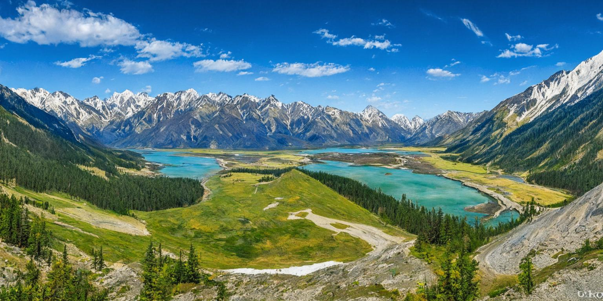
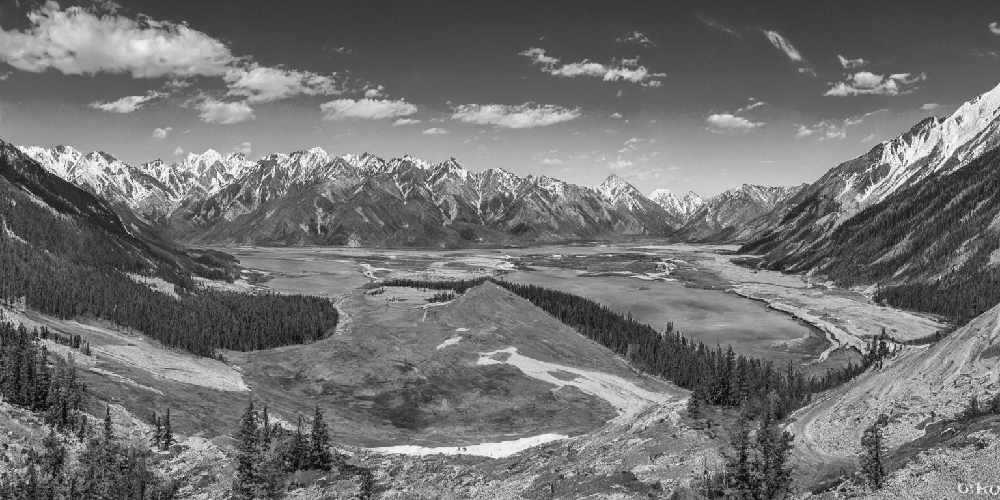
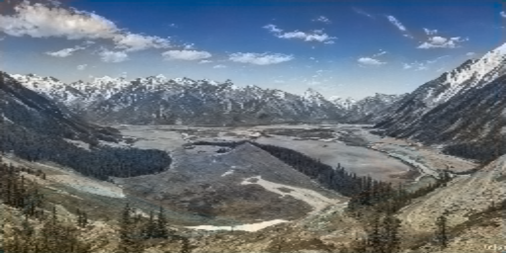
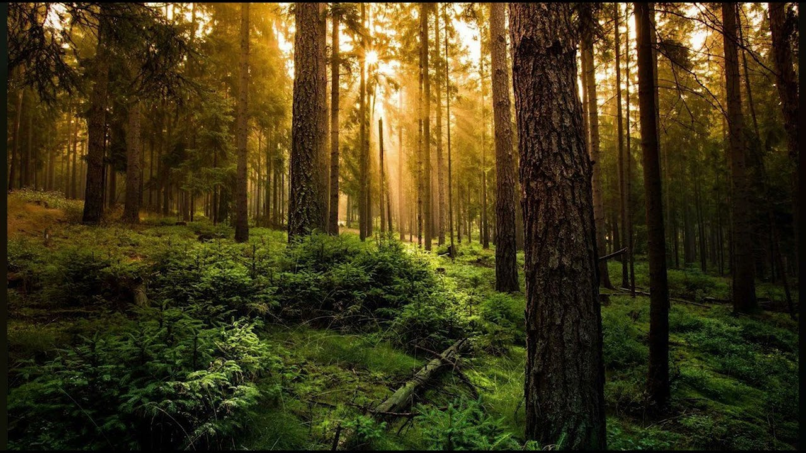
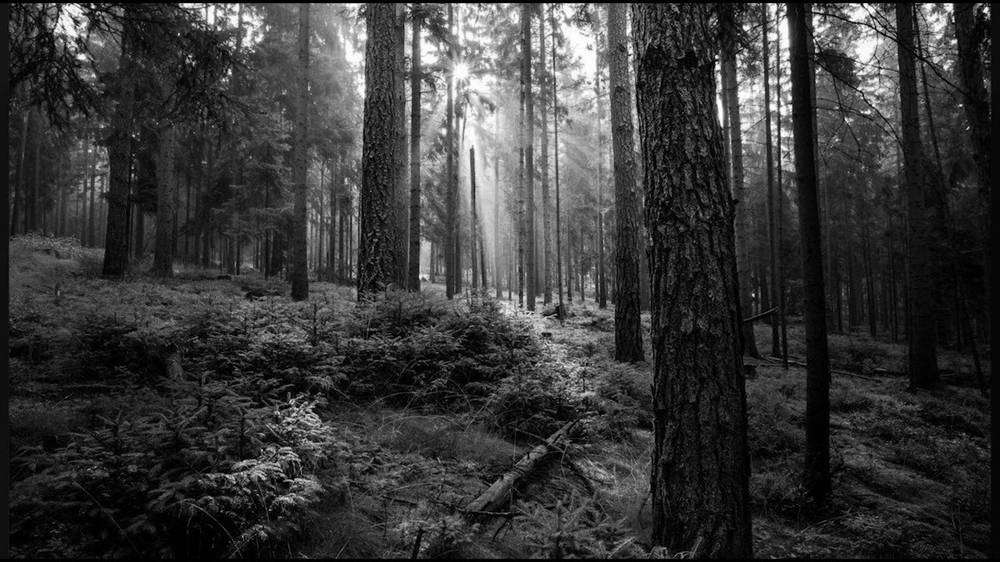
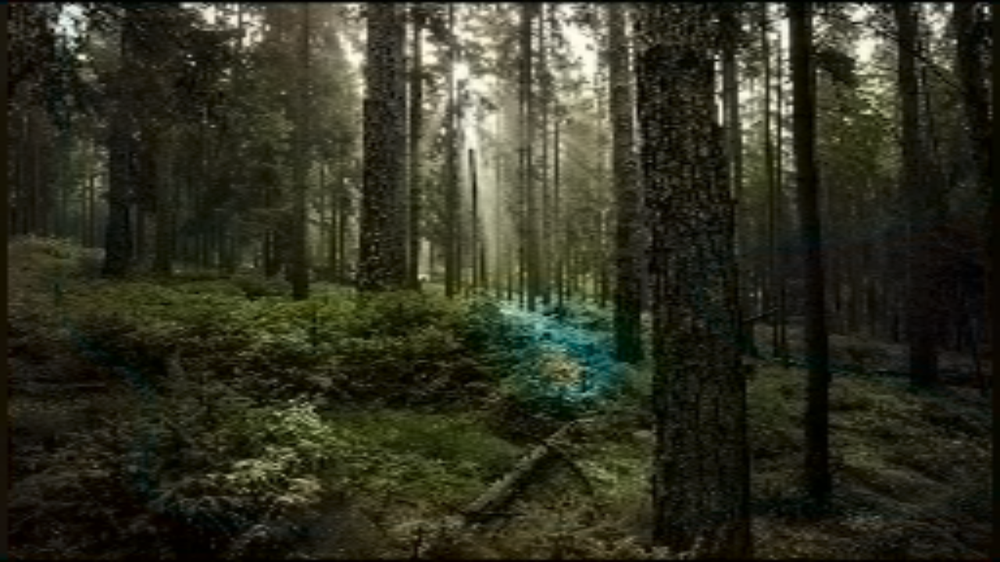
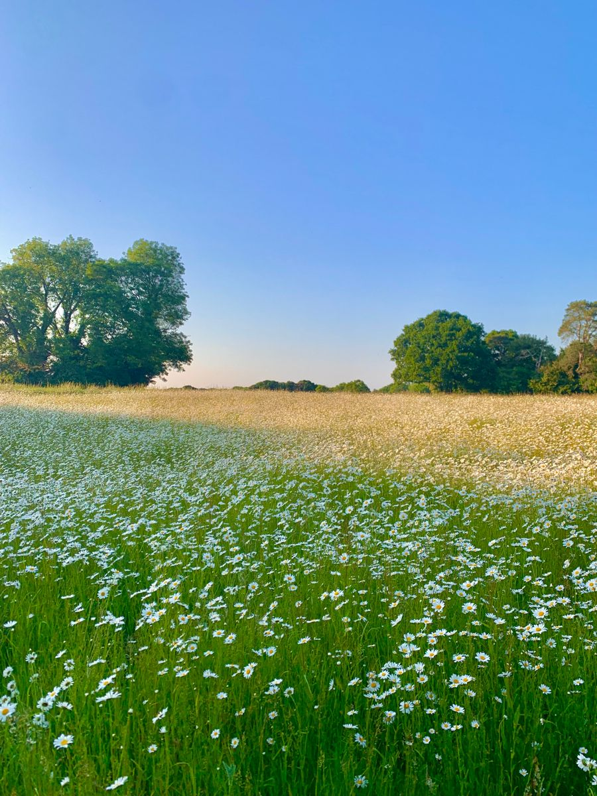
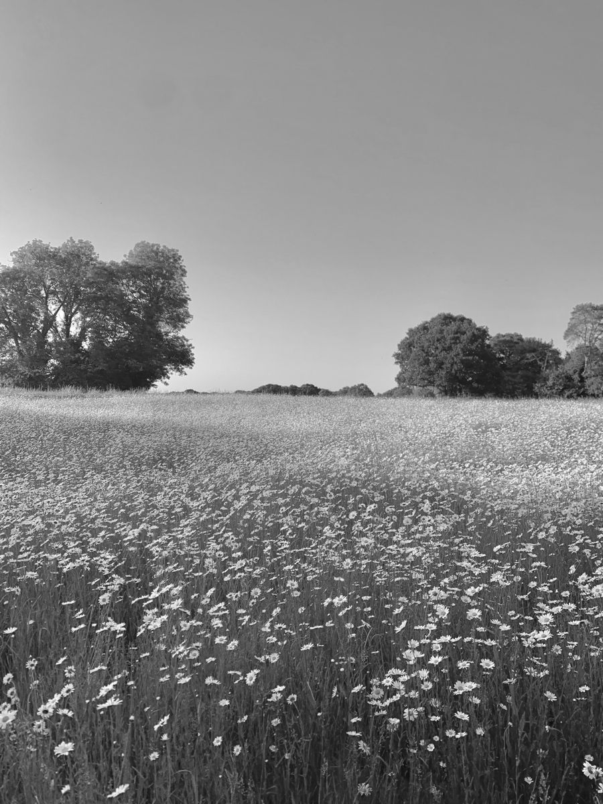
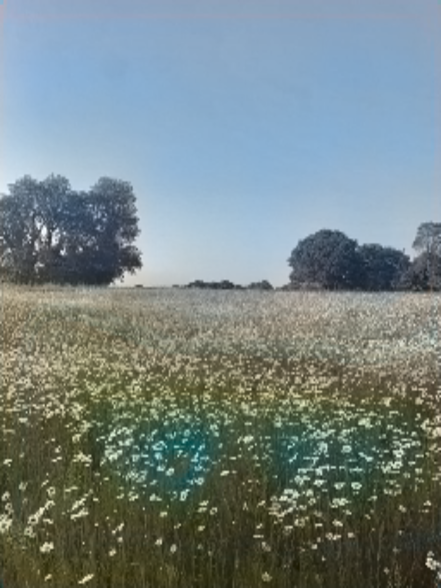

# Image Colorization

## Overview
This project implements automatic colorization of grayscale images using a convolutional neural network. The model takes a single brightness channel as input and predicts the missing color information in LAB color space, producing a plausible full-color version of the original image.

## Requirements

- PyTorch (>= 1.7.0)
- Numpy (>= 1.19.3)
- Matplotlib (>= 3.3.3)
- Scikit-Image (>= 0.18.3)
- TorchVision (>= 0.8.1)
- OpenCV-Python (>= 4.5.4)

## Model Architecture

### Color Space Conversion
Images are processed in the **LAB** color space:
- **L** channel (brightness) serves as the input to the network, representing the grayscale image.
- **A** and **B** channels (chrominance) are predicted by the model.
- At inference, the predicted AB channels are merged with the original L channel and converted back to RGB.

### Network Design
- **Encoder**:  
  Utilizes the first six layers of **ResNet34** as a feature extractor. The initial convolutional layer is modified to accept single-channel input while preserving the pretrained architecture's feature extraction capabilities.

- **Decoder**:  
  A lightweight upsampling decoder composed of convolutional layers, Batch Normalization, and ReLU activations. Progressive ×2 upsampling is applied to restore the original spatial resolution. The final output layer produces 2 channels corresponding to the A and B components.

- **Input / Output**:
  - Input: Grayscale tensor of shape `(batch_size, 1, 224, 224)`
  - Output: AB channels tensor of shape `(batch_size, 2, 224, 224)`

- **Loss Function**: Mean Squared Error (MSE) between predicted and ground-truth AB channels.

## Dataset
The model is trained on the [Landscape Image Colorization](https://www.kaggle.com/datasets/theblackmamba31/landscape-image-colorization) dataset.

## Usage

Clone the repository and install dependencies
```bash
git clone https://github.com/MixeevLexa/image-colorization.git
cd image-colorization
pip install -r requirements.txt
```

The `colorize.py` script accepts any image (grayscale or color) and returns its colorized version.
```bash
python colorize.py --image path/to/your_image.jpg
```

#### Command-line Arguments

| Argument | Default | Description |
|----------|---------|-------------|
| `--image` | — | Path to input image (grayscale or color) |
| `--model` | `model.pth` | Path to pretrained model weights |

## Results

### Example 1

| Original | Grayscale | Colorized |
|:--------:|:---------:|:------------------------:|
|  |  |  |

### Example 2

| Original | Grayscale | Colorized |
|:--------:|:---------:|:------------------------:|
|  |  |  |

### Example 3

| Original | Grayscale | Colorized |
|:--------:|:---------:|:------------------------:|
|  |  |  |
